# What is MCP? A Simple Guide for Everyone

## 🎯 What is MCP in Simple Words?

**MCP (Model Context Protocol)** is like having a smart helper that knows which AI to ask for different questions. Instead of you guessing which AI is best, MCP picks the right one automatically.

**Simple Example:**
- You ask: "Plan a trip to Paris"
- MCP thinks: "This is about travel, so I'll use the travel AI"
- You get: Perfect travel advice instantly

**Without MCP:**
- You ask the coding AI about travel → It says "I can't help with that"
- You ask the travel AI → It gives great advice
- Problem: You wasted time guessing!

**Think of MCP as your smart friend** who knows exactly which expert to call for any question you have.

## 🎨 **MCP Concept Overview**

```mermaid
graph LR
    subgraph "🤔 The Problem"
        A[👤 User: Plan a trip to Paris]
        B[❌ Wrong AI: I only do coding]
        C[😤 Frustrated User]
    end
    
    subgraph "✅ MCP Solution"
        D[👤 User: Plan a trip to Paris]
        E[🧠 MCP: Travel question detected]
        F[🌍 Right AI: Here's your itinerary!]
        G[😊 Happy User]
    end
    
    A --> B --> C
    D --> E --> F --> G
    
    style A fill:#ffebee
    style B fill:#ffebee
    style C fill:#ffebee
    style D fill:#e8f5e8
    style E fill:#f3e5f5
    style F fill:#e8f5e8
    style G fill:#e8f5e8
```



## 🎨 Visual: How MCP Works

```mermaid
graph LR
    A["👤 You Ask:<br/>Plan a trip to Paris"] --> B["🧠 MCP Smart Helper"]
    B --> C{"What type of question?"}
    C -->|Travel Keywords| D["🌍 Travel AI Expert"]
    C -->|Code Keywords| E["💻 Coding AI Expert"]
    C -->|Story Keywords| F["📚 Writing AI Expert"]
    D --> G["✅ Perfect Travel Plan"]
    E --> H["✅ Great Code Solution"]
    F --> I["✅ Amazing Story"]
    
    style A fill:#e1f5fe
    style B fill:#f3e5f5
    style D fill:#e8f5e8
    style E fill:#fff3e0
    style F fill:#fce4ec
    style G fill:#e8f5e8
```



### 🍕 Easy Example: The Food Court Story

Imagine you're at a big food court with different restaurants:

## 🏢 **Food Court Analogy**

```mermaid
graph TD
    subgraph "🏢 Food Court (AI World)"
        A[👤 You: I want pizza!]
        B[🤵 Smart Helper<br/>(MCP System)]
        
        subgraph "🍕 Food Restaurants (AI Models)"
            C[🍕 Pizza Place<br/>(Travel AI)]
            D[🍣 Sushi Place<br/>(Coding AI)]
            E[🍔 Burger Place<br/>(Writing AI)]
        end
    end
    
    A --> B
    B -->|Pizza = Travel question<br/>Go to Pizza Place!| C
    B -.->|Wrong for pizza| D
    B -.->|Wrong for pizza| E
    C --> F[😊 Happy with perfect pizza!]
    
    style A fill:#e3f2fd
    style B fill:#f3e5f5
    style C fill:#e8f5e8
    style D fill:#ffebee
    style E fill:#ffebee
    style F fill:#e8f5e8
```

**Without MCP (Confusing):**
- You want pizza but ask the sushi place → They say "We don't make pizza"
- You try the burger place → They say "No pizza here either"
- You finally find the pizza place → You get your pizza (but wasted lots of time!)

**With MCP (Smart):**
- You say "I want pizza"
- A smart helper hears you and says "Go to the pizza place!"
- You get your pizza right away → Happy and fast!

**In AI Terms:**
- **Food places** = Different AI models (coding AI, travel AI, writing AI)
- **Smart helper** = MCP system
- **Your request** = Your questions
- **Right place** = The best AI for your question

```mermaid
graph TD
    subgraph "🏢 Food Court (AI World)"
        A["👤 You: I want pizza!"]
        B["🤵 Smart Helper<br/>(MCP System)"]
        
        subgraph "🍕 Food Restaurants (AI Models)"
            C["🍕 Pizza Place<br/>(Travel AI)"]
            D["🍣 Sushi Place<br/>(Coding AI)"]
            E["🍔 Burger Place<br/>(Writing AI)"]
        end
    end
    
    A --> B
    B -->|"Pizza = Travel question<br/>Go to Pizza Place!"| C
    B -.->|"Wrong for pizza"| D
    B -.->|"Wrong for pizza"| E
    C --> F["😊 Happy with perfect pizza!"]
    
    style A fill:#e3f2fd
    style B fill:#f3e5f5
    style C fill:#e8f5e8
    style D fill:#ffebee
    style E fill:#ffebee
    style F fill:#e8f5e8
```



---

## 🤔 Why Do We Need MCP? (What Problems Does It Solve?)

### The Big Problem: Too Many AI Choices!

As AI got better, we got more and more different AI models:
- AI for writing code
- AI for planning trips  
- AI for writing stories
- AI for answering questions
- AI for making pictures

**The Problem:** How do you know which one to use?

#### **1. The Guessing Game Problem**

```mermaid
sequenceDiagram
    participant You
    participant CodingAI as 💻 Coding AI
    participant WritingAI as 📚 Writing AI
    participant TravelAI as 🌍 Travel AI
    
    Note over You: "Plan a family trip to Paris"
    
    You->>CodingAI: Plan a family trip to Paris
    CodingAI-->>You: ❌ "I only do code, not travel"
    
    You->>WritingAI: Plan a family trip to Paris  
    WritingAI-->>You: ⚠️ "Here's a basic story about Paris..."
    
    You->>TravelAI: Plan a family trip to Paris
    TravelAI-->>You: ✅ "Perfect! Here's your detailed itinerary..."
    
    Note over You: 😤 Wasted 10 minutes!
```



```
You ask: "Plan a family trip to Paris"

❌ Without MCP:
You → Try coding AI → It says "I only do code, not travel"
You → Try writing AI → It gives basic info
You → Finally try travel AI → Great answer! (but you wasted time)

✅ With MCP:
You → Ask your question → MCP picks travel AI → Perfect answer right away!
```

#### **2. The "I Don't Know Which AI to Use" Problem**

**What happened:**
- AI models got really good at specific things
- But people don't know which AI does what
- Even smart people waste time guessing

**Real example:**
- You need help with Python code
- There are 10 different AI models
- Which one is best for Python? You don't know!
- You try 3 different ones before finding the good one

#### **3. The "Every App is Different" Problem**

```mermaid
graph TB
    subgraph "❌ Before MCP (Messy)"
        A1["📱 App A"] --> B1["🤖 AI Model 1"]
        A2["📱 App B"] --> B2["🤖 AI Model 2"]  
        A3["📱 App C"] --> B3["🤖 AI Model 3"]
        
        style A1 fill:#ffebee
        style A2 fill:#ffebee
        style A3 fill:#ffebee
        style B1 fill:#ffebee
        style B2 fill:#ffebee
        style B3 fill:#ffebee
    end
    
    subgraph "✅ After MCP (Clean)"
        C1["📱 App A"] --> D["🧠 MCP Smart System"]
        C2["📱 App B"] --> D
        C3["📱 App C"] --> D
        
        D --> E1["🤖 Best AI for Task 1"]
        D --> E2["🤖 Best AI for Task 2"]
        D --> E3["🤖 Best AI for Task 3"]
        
        style C1 fill:#e8f5e8
        style C2 fill:#e8f5e8
        style C3 fill:#e8f5e8
        style D fill:#f3e5f5
        style E1 fill:#e8f5e8
        style E2 fill:#e8f5e8
        style E3 fill:#e8f5e8
    end
```



**Before MCP:**
```
App A → Only works with AI Model 1
App B → Only works with AI Model 2  
App C → Only works with AI Model 3

Problems:
- You need 3 different apps
- Each app works differently
- Hard to switch between AIs
```

**After MCP:**
```
App A ↘
App B → MCP → Picks the best AI automatically
App C ↗

Benefits:
- One way to talk to all AIs
- Always get the best AI for your question
- Easy to add new AIs
```

#### **4. The Context Loss Problem**

**Traditional Approach:**
- Each AI interaction is isolated
- No memory of previous conversations
- No understanding of user preferences
- No coordination between different AI tools

**MCP Approach:**
- Maintains context across interactions
- Remembers user preferences and history
- Coordinates multiple AI resources
- Provides coherent, contextual responses

### 📊 Real-World Impact Statistics

| Challenge | Before MCP | After MCP | Improvement |
|-----------|------------|-----------|-------------|
| **Model Selection Accuracy** | ~30% (mostly guessing) | ~95% (intelligent routing) | **3x better** |
| **Time to Correct Response** | 5-15 minutes (trial & error) | 30 seconds (direct routing) | **10-30x faster** |
| **User Frustration Rate** | High (60%+ report confusion) | Low (5% report issues) | **12x reduction** |
| **Developer Integration Time** | Weeks (custom per model) | Days (standardized protocol) | **5-10x faster** |
| **System Maintenance** | High (each model separately) | Low (centralized management) | **Significantly reduced** |

---

## 🔧 How Does MCP Work? (The Simple Way)

### 🧠 Think of MCP Like a Smart Assistant

```
You → Smart Assistant → Right AI Expert → Perfect Answer
```

**Here's what happens step by step:**

#### **Step 1: You Ask a Question**
```
You: "Write a Python function to add two numbers"
```

#### **Step 2: MCP Listens and Thinks**
```
MCP thinks: 
- I see words like "Python" and "function"
- This is about coding
- I should use the coding AI, not the travel AI
```

#### **Step 3: MCP Picks the Right AI**
```
MCP: "This is a coding question, so I'll ask the coding AI"
```

#### **Step 4: You Get the Perfect Answer**
```
Coding AI: "Here's your Python function: def add(a, b): return a + b"
```

### 🏗️ The MCP Team (Who Does What)

Think of MCP like a team of helpers:

```mermaid
graph TD
    subgraph "🏢 MCP Team Headquarters"
        A["👤 You"] --> B["📱 The Listener<br/>(MCP Client)"]
        B --> C["🧠 The Smart Decider<br/>(MCP Server)"]
        C --> D["📋 The Phone Book<br/>(Resource Registry)"]
        C --> E["🔍 The Question Reader<br/>(Intent Analyzer)"]
        C --> F["🚦 The Final Chooser<br/>(Router)"]
    end
    
    subgraph "🤖 AI Expert Team"
        G["💻 Coding AI<br/>Python, JavaScript"]
        H["🌍 Travel AI<br/>Trip Planning"]
        I["📚 Writing AI<br/>Stories, Essays"]
        J["🔬 General AI<br/>Basic Questions"]
    end
    
    F --> G
    F --> H
    F --> I
    F --> J
    
    G --> K["✅ Perfect Code"]
    H --> L["✅ Great Travel Plan"]
    I --> M["✅ Amazing Story"]
    J --> N["✅ Good Answer"]
    
    style A fill:#e3f2fd
    style B fill:#f3e5f5
    style C fill:#f3e5f5
    style D fill:#fff3e0
    style E fill:#fff3e0
    style F fill:#fff3e0
    style G fill:#e8f5e8
    style H fill:#e8f5e8
    style I fill:#e8f5e8
    style J fill:#e8f5e8
```



#### **1. The Listener (MCP Client)**
- **Job:** Hears what you want
- **Example:** Your phone app or computer program
- **What it does:** Takes your question and sends it to the team

#### **2. The Smart Decider (MCP Server)**  
- **Job:** Figures out which AI expert to use
- **What it does:** 
  - Reads your question
  - Thinks "Is this about coding? Travel? Writing?"
  - Picks the best AI expert

#### **3. The Phone Book (Resource Registry)**
- **Job:** Keeps a list of all available AI experts
- **What it has:**
  - Coding AI - good at programming
  - Travel AI - good at trip planning  
  - Writing AI - good at stories and essays
  - General AI - good at basic questions

#### **4. The Question Reader (Intent Analyzer)**
- **Job:** Understands what you really want
- **Examples:**
  - "Plan a trip" → Travel question
  - "Write code" → Programming question
  - "Tell me a story" → Creative writing question

#### **5. The Final Chooser (Router)**
- **Job:** Makes the final decision on which AI to use
- **Thinks about:** Which AI is available, which one is fastest, which one is best for your question

### 🔄 A Real Example: How MCP Works Step by Step

Let's see what happens when you ask: **"Write a Python function to add two numbers"**

```mermaid
sequenceDiagram
    participant You as 👤 You
    participant App as 📱 Your App
    participant MCP as 🧠 MCP System
    participant Registry as 📋 AI Registry
    participant CodingAI as 💻 Coding AI
    participant TravelAI as 🌍 Travel AI
    
    You->>App: Write a Python function to add two numbers
    App->>MCP: Forward question
    
    Note over MCP: 🔍 Reading your question...
    MCP->>MCP: Sees Python + function = CODING!
    
    Note over MCP: 📋 Checking available AIs...
    MCP->>Registry: What AIs are available?
    Registry-->>MCP: Coding AI ✅, Travel AI ✅, Writing AI ✅
    
    Note over MCP: 🚦 Making smart choice...
    MCP->>MCP: Best: Coding AI (perfect for Python!)
    
    MCP->>CodingAI: Someone needs Python function to add numbers
    CodingAI-->>MCP: def add(a,b): return a+b
    
    MCP->>App: Here's the perfect function!
    App->>You: ✅ Perfect Python code delivered!
    
    Note over You: 😊 Got answer in 30 seconds!
    
    %% Show what DIDN'T happen
    MCP-.->TravelAI: ❌ Didn't ask (wrong for coding)
```



#### **Step 1: You Ask**
```
👤 You: "Write a Python function to add two numbers"
↓
📱 Your App: Gets your question, sends it to MCP
```

#### **Step 2: MCP Reads Your Question**
```
🔍 MCP looks at your words:
- Sees: "Python" → This is about programming
- Sees: "function" → This is about coding
- Sees: "add numbers" → This is a coding task
- Conclusion: "This person needs help with coding!"
```

#### **Step 3: MCP Checks What AIs Are Available**
```
📋 MCP looks at its list:
- ✅ Coding AI → Perfect for Python questions
- ❌ Travel AI → Not good for coding
- ❌ Story AI → Not good for coding
- ✅ General AI → Could work, but coding AI is better
```

#### **Step 4: MCP Makes the Smart Choice**
```
🚦 MCP decides:
- Best choice: Coding AI (specialized in programming)
- Why: It's made specifically for coding questions
- Backup: General AI (if coding AI is busy)
```

#### **Step 5: MCP Asks the Coding AI**
```
🤖 MCP tells Coding AI: "Someone needs a Python function to add numbers"
Coding AI: "Got it! Here's the perfect function for them."
```

#### **Step 6: You Get Your Answer**
```
📤 You receive:
"Here's your Python function:

def add_numbers(a, b):
    return a + b

# Example usage:
result = add_numbers(5, 3)
print(result)  # Output: 8"
```

### 🆚 Compare: With MCP vs Without MCP

```mermaid
graph TD
    subgraph "❌ WITHOUT MCP (The Hard Way)"
        A1["👤 You: Write Python function"] --> B1["🤔 You guess: Travel AI?"]
        B1 --> C1["🌍 Travel AI: Sorry, I only do travel"]
        C1 --> D1["🤔 You try: Writing AI?"]
        D1 --> E1["📚 Writing AI: I write stories, not code"]
        E1 --> F1["🤔 Finally try: Coding AI?"]
        F1 --> G1["💻 Coding AI: Perfect! Here's your function"]
        G1 --> H1["😤 Result: 10 minutes wasted!"]
        
        style A1 fill:#ffebee
        style B1 fill:#ffebee
        style C1 fill:#ffebee
        style D1 fill:#ffebee
        style E1 fill:#ffebee
        style F1 fill:#ffebee
        style G1 fill:#fff3e0
        style H1 fill:#ffebee
    end
    
    subgraph "✅ WITH MCP (The Easy Way)"
        A2["👤 You: Write Python function"] --> B2["🧠 MCP: This is coding!"]
        B2 --> C2["💻 Coding AI: Here's your function!"]
        C2 --> D2["😊 Result: 30 seconds, happy!"]
        
        style A2 fill:#e8f5e8
        style B2 fill:#f3e5f5
        style C2 fill:#e8f5e8
        style D2 fill:#e8f5e8
    end
```



#### **Without MCP (The Hard Way):**
```
You: "Write a Python function"
↓
You guess: "Maybe I'll try the travel AI?"
Travel AI: "Sorry, I only help with travel, not coding"
↓
You try: "How about the story AI?"
Story AI: "I write stories, not code"
↓
You finally try: "Coding AI?"
Coding AI: "Perfect! Here's your function..."

Result: ❌ Wasted 10 minutes, got frustrated
```

#### **With MCP (The Easy Way):**
```
You: "Write a Python function"
↓
MCP: "This is coding, I'll use the coding AI"
↓
Coding AI: "Here's your function!"

Result: ✅ Got answer in 30 seconds, happy!
```

## 📊 Why MCP is Amazing (Simple Numbers)

| What | Before MCP | After MCP | How Much Better |
|------|------------|-----------|-----------------|
| **Getting the right answer** | 3 out of 10 times | 9 out of 10 times | **3x better** |
| **Time to get answer** | 5-15 minutes | 30 seconds | **10-30x faster** |
| **How frustrated you get** | Very frustrated | Happy | **Much better** |
| **How easy to use** | Hard (need to know which AI) | Easy (just ask) | **Super easy** |

## 🎯 What You Learned (Simple Summary)

### **The Problem MCP Solves:**
- Too many different AIs to choose from
- People don't know which AI is best for their question
- Lots of time wasted guessing wrong
- Frustrating experience

### **How MCP Helps:**
- You just ask your question normally
- MCP automatically picks the best AI
- You get the perfect answer right away
- No more guessing, no more frustration

### **Why This Matters:**
- **For You:** Get better answers faster
- **For Developers:** Easier to build AI apps
- **For Companies:** Better AI systems
- **For Everyone:** AI becomes much easier to use

### **The Big Idea:**
MCP changes AI from "Which AI should I use?" to "Just ask your question and get the best answer." It's like having a smart friend who always knows the right expert to call.

```mermaid
graph LR
    subgraph "🔄 The MCP Transformation"
        A["❌ Before MCP<br/>Guess which AI<br/>Waste time<br/>Get frustrated"] 
        A --> B["🧠 MCP Magic"]
        B --> C["✅ After MCP<br/>Just ask question<br/>Get perfect answer<br/>Stay happy"]
    end
    
    subgraph "🎯 The Result"
        D["😊 You focus on<br/>your real work<br/>instead of<br/>AI confusion"]
    end
    
    C --> D
    
    style A fill:#ffebee
    style B fill:#f3e5f5
    style C fill:#e8f5e8
    style D fill:#e3f2fd
```



## 🚀 Ready to Try It?

Now that you understand what MCP is and why it's helpful, let's see it in action!

### **What's Next:**
1. **See the Problem:** Try asking the wrong AI and see what happens
2. **See the Solution:** Use MCP and see how it picks the right AI automatically  
3. **Understand the Code:** Look at how MCP makes smart decisions
4. **Build Your Own:** Create your own MCP rules

```mermaid
graph TD
    A["📚 You just learned MCP theory"] --> B["🔍 Step 1: See the Problem"]
    B --> C["✅ Step 2: See the Solution"]
    C --> D["🧠 Step 3: Understand the Code"]
    D --> E["🛠️ Step 4: Build Your Own"]
    E --> F["🎓 MCP Master!"]
    
    style A fill:#e3f2fd
    style B fill:#fff3e0
    style C fill:#e8f5e8
    style D fill:#f3e5f5
    style E fill:#fce4ec
    style F fill:#e8f5e8
```



### **Key Takeaway:**
MCP makes AI simple. Instead of you having to be an AI expert, MCP is the expert for you. You just ask questions and get great answers!

**The future of AI is not about knowing which AI to use - it's about AI knowing which AI you need.** 🌟

---

**Ready to see this in action? Let's try some examples!** 🎯

---

## 👨‍💻 **About the Author**
**Varun Kumar Manik** - AWS Community Builder, DevOps Engineer, and AI Trainer with extensive experience in cloud architecture and AI system design. Passionate about making complex AI concepts accessible through hands-on learning experiences. Specializes in bridging the gap between theoretical AI knowledge and practical implementation.
