# MCP Presentation 🎯

**Interactive presentation explaining Model Context Protocol (MCP) - the universal bridge connecting AI to everything.**

## Quick Start
Open `index.html` in your browser to view the presentation.

## 📊 **Presentation Flow**

```mermaid
flowchart TD
    A["🎯 What is MCP?"] --> B["📚 History & Development"]
    B --> C["❌ The Problem"] 
    C --> D["🔧 Traditional Solutions"]
    D --> E["✅ MCP Solution"]
    E --> F["🏗️ Architecture"]
    F --> G["🆚 Agents vs MCP"]
    G --> H["🌍 Real Examples"]
    H --> I["🚀 Future & Benefits"]
    
    style A fill:#e3f2fd
    style E fill:#e8f5e8
    style I fill:#f3e5f5
```

## What's Covered
- What is MCP and why it matters
- Traditional AI limitations vs MCP solutions  
- Real-world examples and architecture
- Future of AI integration

Perfect for understanding how MCP transforms AI from isolated tools to connected systems.

---

